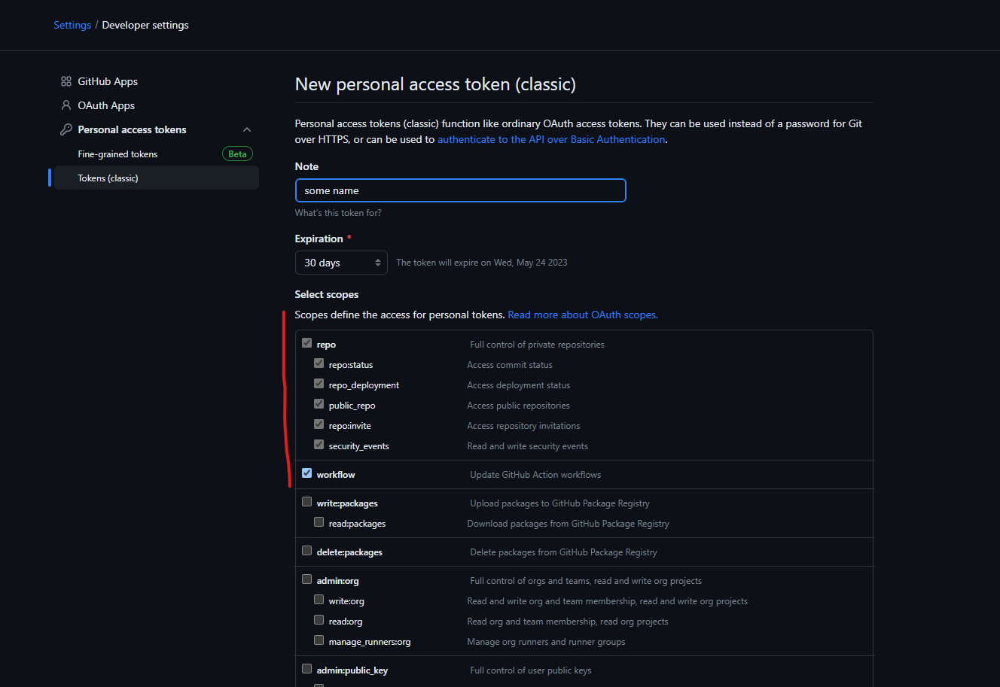

## GET GIT

This utility is for people who want to clone multiple git projects from same domain with multiple accounts. switching between accounts is proven to be harder and tough. 
Setting up SSH is also a redundant and hard job to do.

#### Prerequisities and knowledge:

* create access token from github. go to developer settings -> access token (classic) -> provide necessary access. Copy the password and have it somewhere since you can view it again.

* username
* https url to repo
* git installed in system


#### installation

```
npm i -g get_git_http
```

#### git url

```
https://github.com/sudharsan-gandhi/get_git
```

#### running the application

```
getgit
```

or use alias

```
gg
```

it will prompt for questions and collect details to download the application
